# GPIO基础知识

## GPIO入门知识

### GPIO是什么？

全称： general purpose input output
通用输入输出端口。
可以做输入也可以做输出。
GPIO端口可通过程序配置成输入或者输出。

### 引脚和GPIO的区别和联系？

STM32的引脚中，有部分是做GPIO使用，部分是电源引脚/复位引脚/启动模式引脚/晶振引脚/调试下载引脚。

~~## STM32FXXXIGT6~~

~~①一共有9组IO: PA~PI
②其中PA~PH 每组16个IO
PI只有PI0~PI11
③一共有140个IO口：
16*8+12=140~~

### 绝多数引脚都是GPIO，有限的引脚怎么实现更多的功能？

STM32的大部分引脚除了当GPIO使用外，还可以复用为外设功能引脚（比如串口）。一个引脚，可以作为IO口，同时也可以作为复用功能外设引脚。

### 复用原理

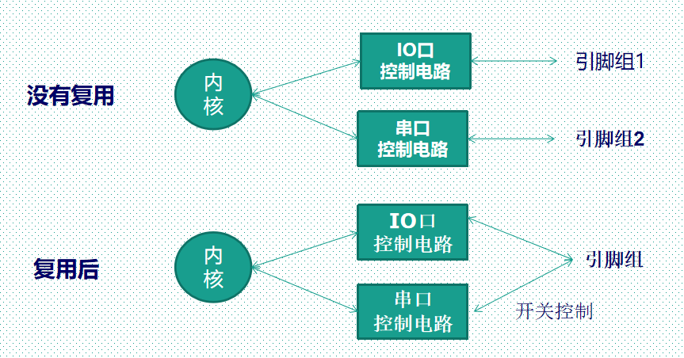
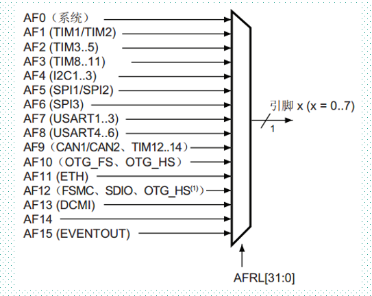

### 怎么查看GPIO引脚功能？

每个STM32芯片的芯片数据手册都会提供引脚功能描述
芯片获取可以去[ST官方](https://www.st.com/content/st_com/zh.html)下载

## GPIO的8种工作模式

### 4种输入模式

       输入浮空
       输入上拉
       输入下拉
       模拟输入

### 4种输出模式(带上下拉）

       开漏输出(带上拉或者下拉)
       开漏复用功能(带上拉或者下拉)
       推挽式输出(带上拉或者下拉)
       推挽式复用功能(带上拉或者下拉)

### 4种最大输出速度

       -2MHZ   低速
       -25MHz  中速
       -50MHz  快速
       -100MHz 高速
      在F429参考手册描述可以直接找到速度值，F767的参考手册直接描述为低/中/快/高速，实际上F767的高速是可以达到108MHz。F429和F767输出速度差别不大。
   
     8种工作模式的区别：STM32八种IO口模式区别.pdf

### IO口基本结构（F4XX和F7XX一模一样）

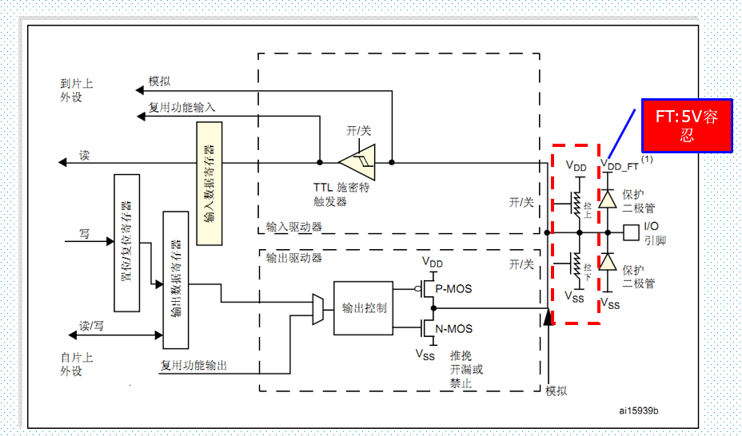

#### M3的IO口基本结构

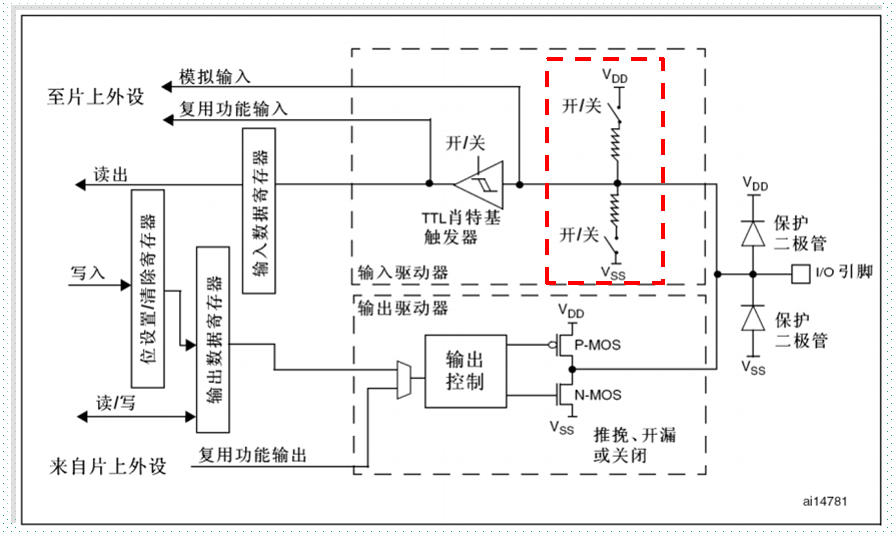

### GPIO的输入工作模式1—输入浮空模式

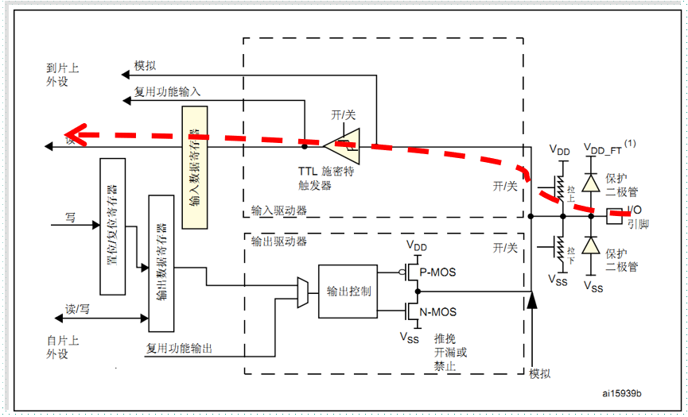

### GPIO的输入工作模式2—输入上拉模式

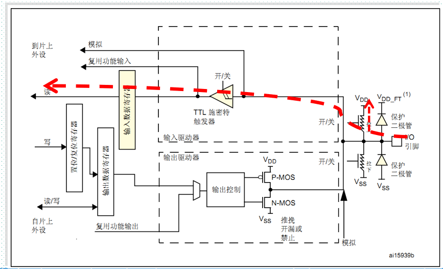

### GPIO的输入工作模式3—输入下拉模式

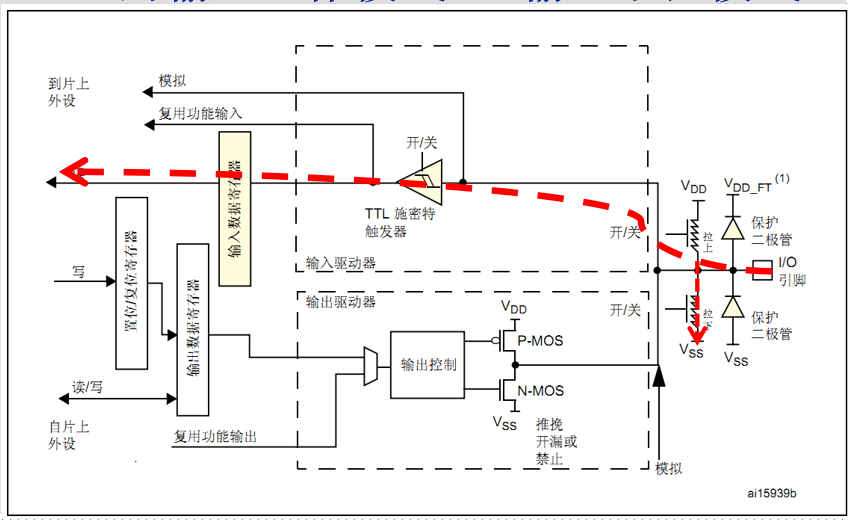

### GPIO的输入工作模式4—模拟模式

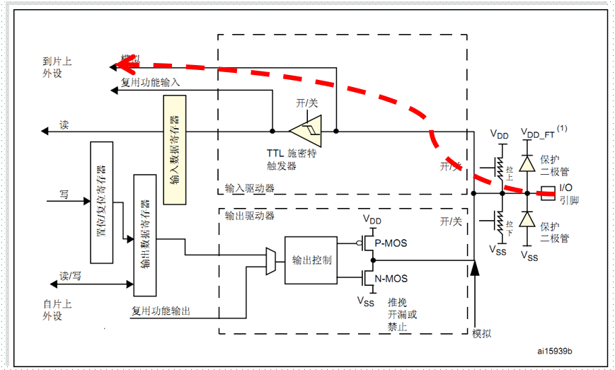

### GPIO的输出工作模式1—开漏输出模式

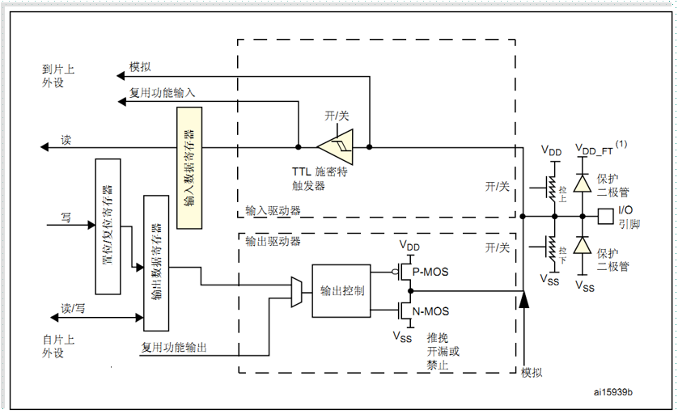
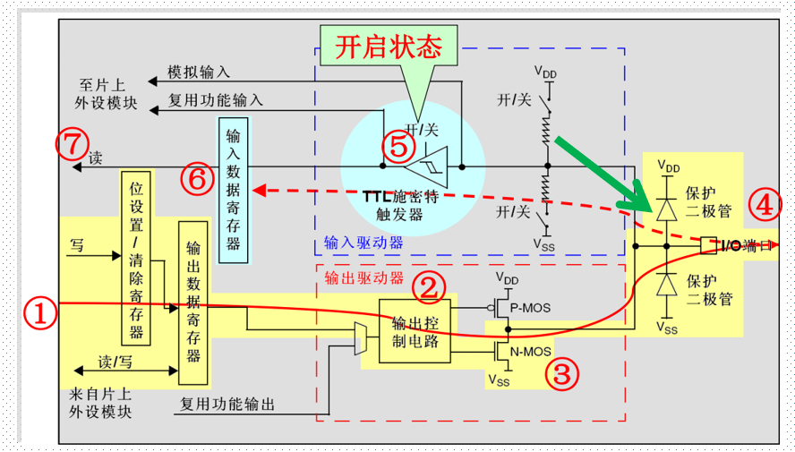

### GPIO的输出工作模式2—开漏复用输出模式

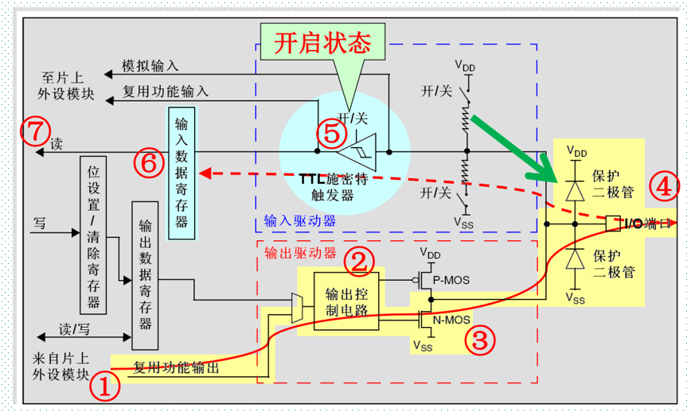

### GPIO的输出工作模式3—推挽输出模式

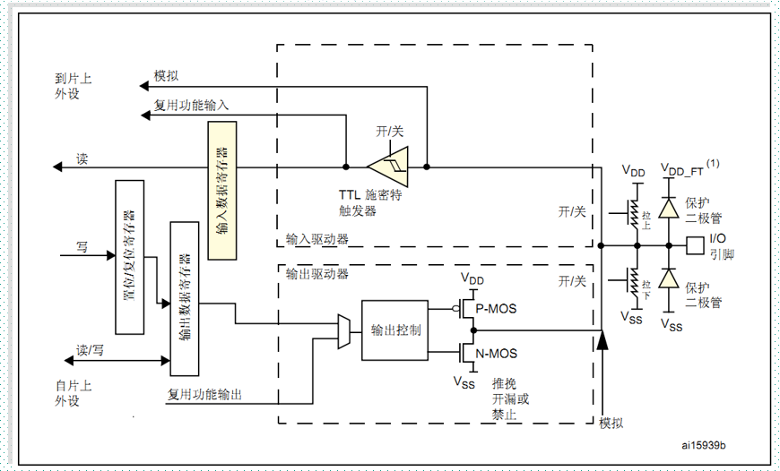
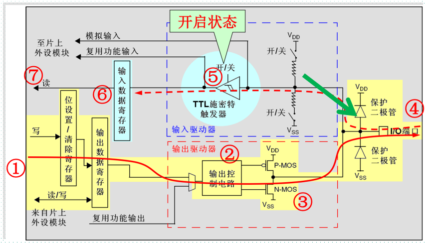

### GPIO的输出工作模式4—推挽复用输出模式

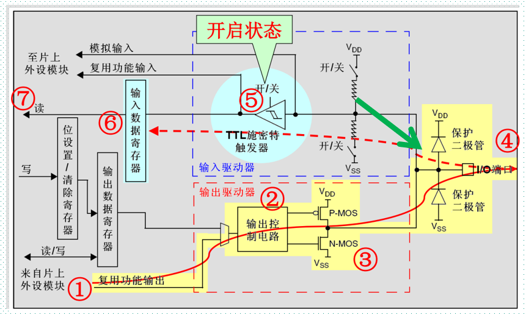

### 推挽输出

可以输出强高低电平，连接数字器件 

### 开漏输出

只可以输出强低电平，高电平得靠外部电阻拉高。输出端相当于三极管的集电极. 要得到高电平状态需要上拉电阻才行. 适合于做电流型的驱动,其吸收电流的能力相对强(一般20ma以内)

### 上电复位后IO口状态

上电复位后，GPIO默认为输入浮空状态，部分特殊功能引脚为特定状态。
复位后，调试引脚处于复用功能上拉/下拉状态：

- PA15：JTDI处于上拉状态
- PA14:JTCK/SWCLK处于下拉状态
- PA13:JTMS/SWDAT处于下拉状态
- PB4:NJTRST处于上拉状态
- PB3:JTDO处于浮空状态

## GPIO寄存器

### 每组GPIO端口的寄存器包括

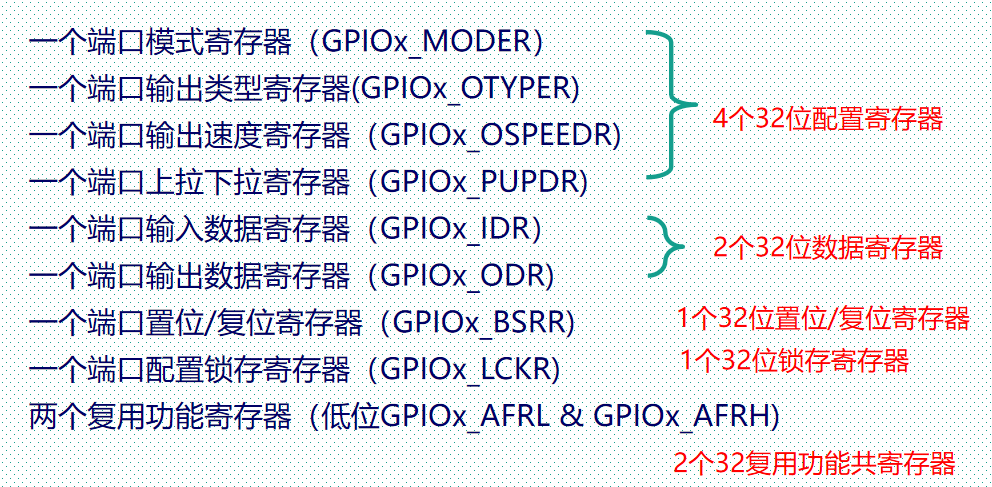

#### 重点说明

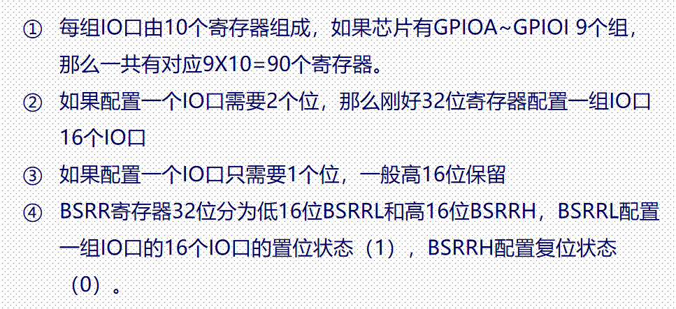

