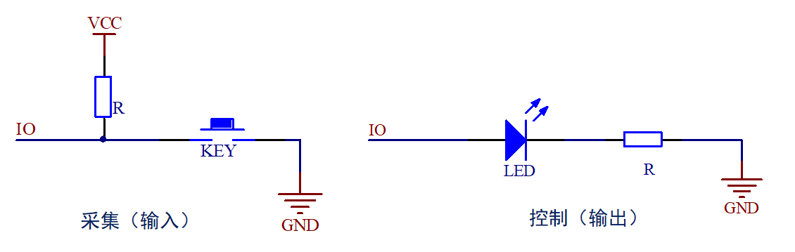
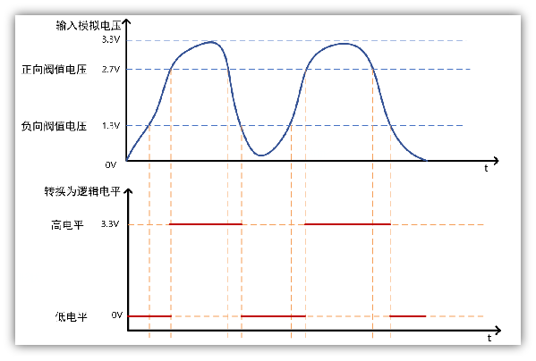

# GPIO

## 什么是GPIO？

General Purpose Input Output，即通用输入输出端口，简称GPIO
作用：负责采集外部器件的信息或者控制外部器件工作，即输入输出

## STM32 GPIO简介

### GPIO特点

1. 不同型号，IO口数量可能不一样，可通过选型手册快速查询
2. 快速翻转，每次翻转最快只需要两个时钟周期（F1最高速度可以到50Mhz）
3. 每个IO口都可以做中断
4. 支持8种工作模式

### GPIO电气特性

1. STM32工作电压范围
    > 2 V ≤ VDD ≤ 3.6 V

2. GPIO识别电压范围
    > COMS端口：
    -0.3V ≤ VIL ≤ 1.164V
    1.833V ≤ VIH ≤ 3.6V

3. GPIO输出电流
    > 单个IO，最大25mA

### GPIO引脚分布

* STM32引脚类型：
    > 电源引脚、晶振引脚、复位引脚、下载引脚、BOOT引脚、GPIO引脚

* 不同芯片引脚分布情况

|正点原子开发板|芯片型号|IO数|GPIO分组情况|
|---|---|---|---|
|Mini|STM32F103RCT6|51|GPIOA ~ GPIOC、GPIOD：PD0~PD2|
|精英|STM32F103ZET6|112|GPIOA ~ GPIOG|
|战舰|STM32F103ZET6|112|GPIOA ~ GPIOG|
|探索者|STM32F407ZGT6|114|GPIOA ~ GPIOG、GPIOH：PH0~PH1|
|阿波罗F429|STM32F429IGT6|140|GPIOA ~ GPIOH、GPIOI：PI0~PI11|
|阿波罗F767|STM32F767IGT6|140|GPIOA ~ GPIOH、GPIOI：PI0~PI11|
|阿波罗H743|STM32H743IIT6|140|GPIOA ~ GPIOH、GPIOI：PI0~PI11|
|北极星F750|STM32F750N8H6|168|GPIOA ~ GPIOJ、GPIOK：PK0~PK11|
|北极星H750|STM32H750XBH6|168|GPIOA ~ GPIOJ、GPIOK：PK0~PK11|
|MINI PRO H750|STM32H750VBT6|82|GPIOA ~ GPIOE、GPIOH：PH0~PH1|
**IO引脚分布特点：按组存在、组数视芯片而定、每组最多16个IO引脚**

## IO端口基本结构介绍

* F1的IO结构图

* F4/F7/H7的IO结构图

* F1系列IO端口基本结构

① 保护二极管
② 内部上拉、下拉电阻
③ 施密特触发器
④ P-MOS & N-MOS管

* 施密特触发器简介
施密特触发器就是一种整形电路，可以将非标准方波，整形成方波

特点：
>当输入电压高于正向阈值电压，输出为高；
>当输入电压低于负向阈值电压，输出为低；
>当输入在正负向阈值电压之间，输出不改变。

作用：
>整形！如正弦波转方波

* P-MOS & N-MOS管简介
MOS管是压控型元件，通过控制栅源电压（ Vgs ）来实现导通或关闭。

